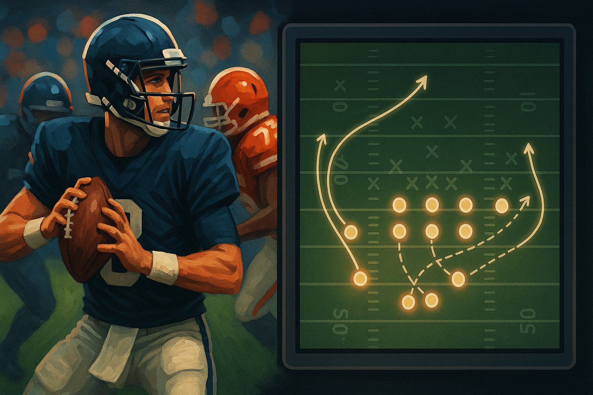
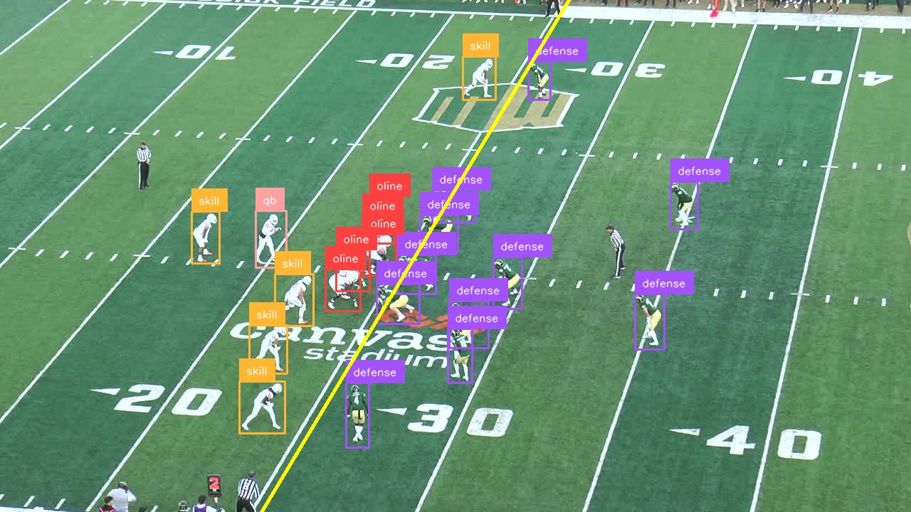
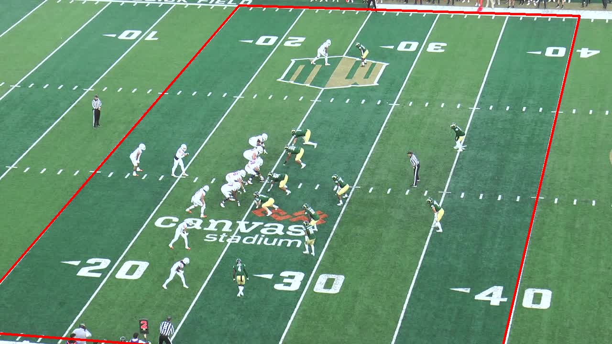
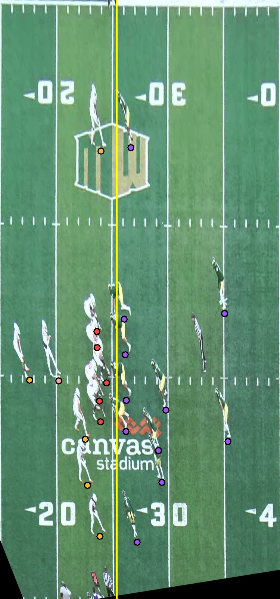
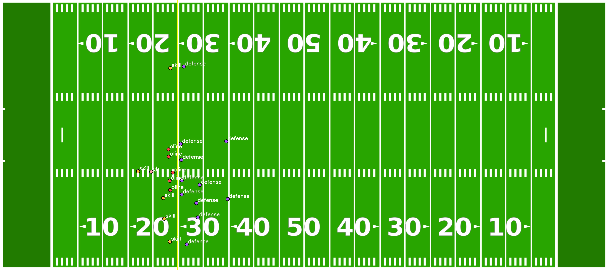

# Automated Pre-Play Analysis of American Football Formations
---

## 📖 Overview

This repository implements a **modular pipeline** for detecting and classifying offensive formations in American
football from broadcast video. The project builds upon the paper:

> **Automated Pre-Play Analysis of American Football**  
> Lasse Wilhelm, Justin Getzke  
> University of Cologne, 2025

The pipeline integrates:

- **Roboflow 3.0 model** for player detection
- **Homography-based field registration** using yard lines & hash marks
- **Formation classification** based on personnel grouping (RB, TE, WR) and positional alignment
- **Visualization tools** for annotated broadcast frames and standardized bird’s-eye views

The system achieves **formation recognition accuracy on par with expert human analysts**, while reducing the time
required for analysis from hours to minutes.

---

## Video of the complete pipeline in action :
[](https://www.youtube.com/watch?v=qCe0WocvSz8)

https://www.youtube.com/watch?v=qCe0WocvSz8

## 📊 Example Output

<div style="display: flex; flex-wrap: wrap; gap: 20px; justify-content: center;">
    
  <div style="flex: 1 1 45%; text-align: center;">
    <h3>Broadcast frame with bounding boxes + LOS</h3>
    
  </div>

  <div style="flex: 1 1 45%; text-align: center;">
    <h3>Field Boundary Detection</h3>
    
  </div>

  <div style="flex: 1 1 45%; text-align: center;">
    <h3>Bird’s-Eye Projection</h3>
    
  </div>

  <div style="flex: 1 1 45%; text-align: center;">
    <h3>Standardized top-down view with player positions & formation label</h3>
    
  </div>

</div>

---

## 🚀 Features

- 🎥 **Frame Selection**: Extracts relevant pre-snap frames using FFmpeg scene detection
- 🏈 **Player Detection**: Custom trained Roboflow 3.0  model for offensive line, QB, skill players, defense, referees
- 📐 **Field Registration**: Detects yard lines & hash marks, computes homography for top-down scaling
- 📊 **Formation Classification**: Classifies offensive personnel groups (10, 11, 12, …) + alignment (L/R balance, TE
  positions)
- 🖼 **Visualization**: Annotated broadcast frames + top-down tactical diagrams

---

## Project Architecture

### High-Level Overview
This desktop app packages a **Next.js** UI inside a **Tauri** shell and spawns a **Python FastAPI** server as a *sidecar* process. The Python service runs the vision/ML pipeline (player detection, field registration via homography, formation classification) and exposes HTTP endpoints that the UI calls for analysis and visualization. The result is a single, cross-platform binary with native performance and a modern web UI. :contentReference[oaicite:0]{index=0}

**Tech stack**
- **Shell:** Tauri (Rust) with a sidecar for the backend
- **Frontend:** Next.js (TypeScript) + Tailwind/Shadcn (per `components.json`)
- **Backend:** Python FastAPI + required CV/ML deps (see [requirements.txt](`requirements.txt`))
- **Artifacts:** Annotated frames and bird’s-eye/top-down projections of formations :contentReference[oaicite:1]{index=1}
- **Model:** Roboflow 3.0 model for player detection

### Modules & Boundaries
- **Tauri (src-tauri/…)**  
  - Configures the desktop window and registers a **sidecar** binary/command to launch the FastAPI server alongside the UI.
  - Manages app lifecycle signals (spawn/kill) and forwards logs for debugging.
- **Frontend (src/… with Next.js)**  
  - Pages and components to load media, trigger analyses, and render results (bounding boxes, LOS overlays, top-down diagrams).
  - Calls backend endpoints (e.g., `/analyze-snap`) via `fetch`.
- **Backend (src-python/… with FastAPI)**  
  - Endpoints for: frame extraction, detection, homography solve, formation classify, and asset retrieval.
  - Pipelines orchestrated as Python services utilizing the ML/CV libraries declared in `requirements.txt`.

# 🏃 Usage

## Application Setup

This guide walks you through running the **football-pre-play-analysis** desktop application using **Tauri** with a **Next.js** frontend and a **Python FastAPI** sidecar.

> For feature walkthrough and how to use the UI, please refer to the **provided video**.

---

### Prerequisites

Install these tools first and ensure they are available on your PATH.

- **Rust** (via `rustup`) and **Cargo**
  - Check: `rustc --version` and `cargo --version`
- **Node.js** (LTS recommended) and **pnpm**
  - Check: `node -v`, `pnpm -v`
  - Install pnpm if needed: `npm i -g pnpm`
- **Python 3.11** and **pip**
  - Check: `python --version` (or `python3 --version`), `pip --version`
- **git**

### Platform-specific notes

- **Windows**
  - Install **Microsoft Visual Studio Build Tools** (Desktop development with C++).
  - Ensure **WebView2 Runtime** is installed (usually present on Win10+).
- **macOS**
  - Install **Xcode Command Line Tools**: `xcode-select --install`
- **Linux**
  - Install system deps as required by Tauri/WebKitGTK (e.g., `webkit2gtk`, `gtk3`, `libappindicator`).
  - Package names vary by distro; see your distro’s package manager.

---

### Setup

1) **Clone the repository**
```bash
git clone https://github.com/jxstixn/football-pre-play-analysis.git
cd football-pre-play-analysis
```

2) **Install Next.js (frontend) dependencies**
```bash
pnpm i
```

3) **Install Python (backend) dependencies**
> Optional but recommended: create a virtual environment first.

```bash
# (optional) create & activate a venv
python -m venv .venv
# Windows
.\.venv\Scripts\activate
# macOS/Linux
# source .venv/bin/activate

# install backend deps
pip install -r requirements.txt
```

4) **Build the FastAPI sidecar**
> Choose the command for your platform.

```bash
# Windows
pnpm build:sidecar-windows

# macOS
pnpm build:sidecar-macos

# Linux
pnpm build:sidecar-linux
```

This step compiles/builds the Python FastAPI sidecar (or prepares its executable/bundle) so Tauri can spawn it at runtime.

---

### Run the App (Development)

```bash
pnpm tauri dev
```

- Tauri will start the desktop shell, serve the Next.js frontend, and **spawn the Python FastAPI sidecar**.
- Watch the terminal for logs. The application will open a desktop window automatically.

---

### Troubleshooting

- **Sidecar not found / fails to spawn**
  - Verify sidecar build step completed successfully for your OS.
  - Check paths in `src-tauri/tauri.conf.json` (command, args, and working directory).
- **Python version / packages mismatch**
  - Confirm you’re using **Python 3.11**.
  - Reinstall deps: `pip install -r requirements.txt` (in your active venv).
- **Port conflicts**
  - If the sidecar binds to `127.0.0.1:<port>`, ensure that port is free or update config and frontend env accordingly.
- **Windows build issues**
  - Ensure **MSVC Build Tools** are installed; try opening a fresh **x64 Native Tools Command Prompt**.
- **macOS “App is damaged or can’t be opened”**
  - Gatekeeper/quarantine may block unsigned builds; you may need to allow the app in **System Settings → Privacy & Security**.
- **Linux missing dependencies**
  - Install WebKitGTK/GTK3 packages per your distro; restart the app.

---

## Manual Setup with Jupyter Notebook

This project can also be run directly through Jupyter notebooks without packaging the full Tauri app. This is useful for experimenting with the pipeline, running custom clips, or debugging intermediate results.

#### Prerequisites
- Python 3.11
- pip
- git
- [Jupyter](https://jupyter.org/install)

---

### 1. Clone the repository

```bash
git clone https://github.com/jxstixn/football-pre-play-analysis.git
cd football-pre-play-analysis
```

---

### 2. Install Python dependencies

```bash
pip install -r requirements.txt
```

---

### 3. Launch Jupyter

```bash
jupyter notebook
```

---

### 4. Prepare your input clips

- Place raw football match clips (MP4) into the **same folder** as the [football_play_cutting.ipynb](notebooks/football_play_cutting.ipynb).

---

### 5. Run the cutting notebook

- Open [football_play_cutting.ipynb](notebooks/football_play_cutting.ipynb).
- Run all cells — this will cut the video into frames.  

---

### 6. Run the analysis pipeline

- Open [football_pre_play_analysis.ipynb](notebooks/football_pre_play_analysis.ipynb).
- Adjust the **file paths** to point to the extracted images.  
- Run the cells in order.

---

### 7. Review Results

- The pipeline outputs annotated images and top-down formation diagrams.  
- Saved locally and displayed inline in the notebook.

---

## 📜 Citation

````
@inproceedings{prePlayAnalysis2025,
  title={Automated Pre-Play Analysis of American Football},
  author={Getzke, Justin and Wilhelm, Lasse},
  year={2025},
  institution={University of Cologne}
}
```
