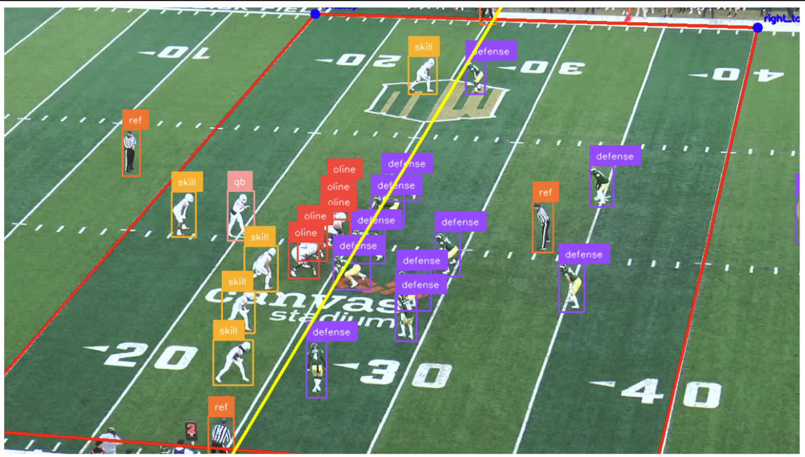
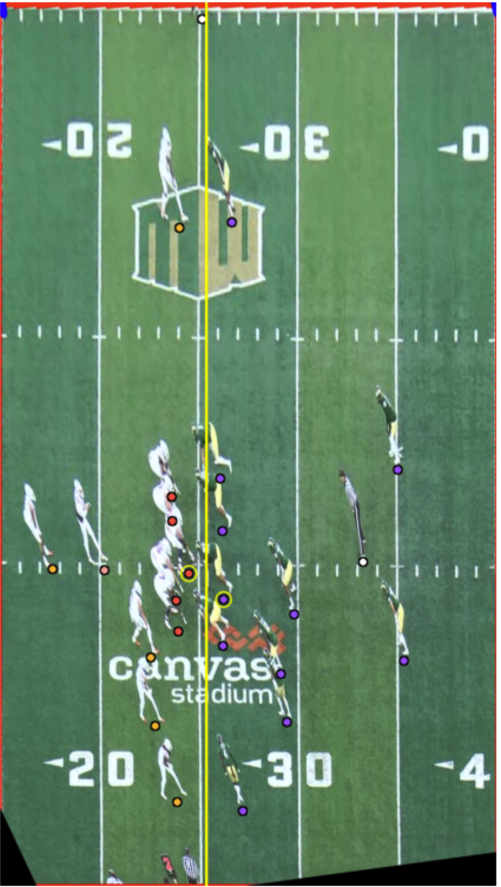
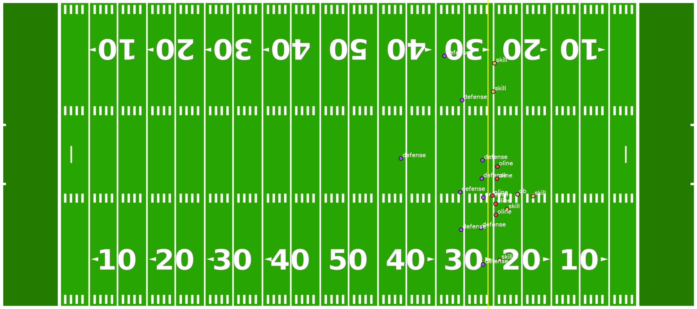

# Automated Pre-Play Analysis of Football Formations
---

## 📖 Overview

This repository implements a **modular pipeline** for detecting and classifying offensive formations in American
football from broadcast video. The project builds upon the paper:

> **Automated Pre-Play Analysis of Football**  
> Lasse Wilhelm, Justin Getzke  
> University of Cologne, 2025

The pipeline integrates:

- **Roboflow 3.0 model** for player detection
- **Homography-based field registration** using yard lines & hash marks
- **Formation classification** based on personnel grouping (RB, TE, WR) and positional alignment
- **Visualization tools** for annotated broadcast frames and standardized bird’s-eye views

The system achieves **formation recognition accuracy on par with expert human analysts**, while reducing the time
required for analysis from hours to minutes.

---

## 🚀 Features

- 🎥 **Frame Selection**: Extracts relevant pre-snap frames using FFmpeg scene detection
- 🏈 **Player Detection**: Custom trained Roboflow 3.0  model for offensive line, QB, skill players, defense, referees
- 📐 **Field Registration**: Detects yard lines & hash marks, computes homography for top-down scaling
- 📊 **Formation Classification**: Classifies offensive personnel groups (10, 11, 12, …) + alignment (L/R balance, TE
  positions)
- 🖼 **Visualization**: Annotated broadcast frames + top-down tactical diagrams

---

## Project Architecture

```

```

# 🏃 Usage

## Application Setup


## Manual Setup with Jupyter Notebook

````
Prerequisites:
````

1. Clone the repository:

   ```bash
   git clone


## Video of the complete pipeline in action :
[](https://www.youtube.com/watch?v=dQw4w9WgXcQ)

## 📊 Example Output

Broadcast Frame with Detection

<div style="display: flex; flex-wrap: wrap; gap: 20px; justify-content: center;">

  <div style="flex: 1 1 45%; text-align: center;">
    <h3>Bounding boxes + LOS line</h3>
    
  </div>

  <div style="flex: 1 1 45%; text-align: center;">
    <h3>Bird’s-Eye Projection</h3>
    
  </div>

  <div style="flex: 1 1 45%; text-align: center;">
    <h3>Standardized top-down view with player positions & formation label</h3>
    
  </div>

</div>

## 📜 Citation

````
@inproceedings{prePlayAnalysis2025formation,
  title={Automated Pre-Play Analysis of Football},
  author={Getzke, Justin and Wilhelm, Lasse},
  year={2025},
  institution={University of Cologne}
}
```
